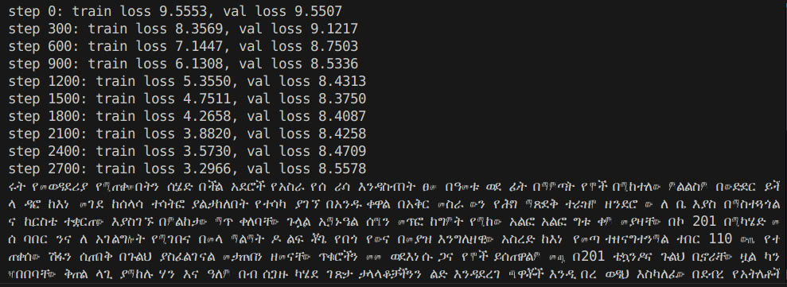

# amharic_tokenizer and model training 

This repository contains an Amharic tokenizer. The model is trained using a very simple transformer architecture as suggested by [Andrew Karpathy](https://en.wikipedia.org/wiki/Andrej_Karpathy) in his [YouTube course](https://www.youtube.com/watch?v=kCc8FmEb1nY&list=PLAqhIrjkxbuWI23v9cThsA9GvCAUhRvKZ&index=7&ab_channel=AndrejKarpathy). The model is trained on the `amharic_text_shortened` file which is a shortened version of the `amharic_text` file.(this file is not found in this github repository but the steps to get it are described below).The model is trained on bigrams and can be used to generate text.

## Files

- `tokenizer.py`: Contains the building of the tokenizer using the file `amharic_txt_tokenizing`.
- `test.py`: A test to check basic tokenizing operations.
- `encoding_example.py`: An example showing the encoder in action.
- `csv_to_txt.py`: A script to change a the  csv file[found here](https://www.kaggle.com/datasets/mathurinache/amharicnewstextclassificationdataset) to txt file. since the txt file returned from this particular csv is very large, I have shortened it to `amharic_text_shortened`. but make sure the folder amharic_dataset is created locally and the csv file is found inside if you want replicate the whole txt file. But using the shortened version is enough for the model to train.

- `bigram_model.py`: Where training of the model and a basic example is shown.
- `gpt.py`: A larger part of `bigram_model.py` that contains more classes for better context and output.

## How to Run

1. Run the `tokenizer.py` file to get the JSON file.
2. Run the `bigram_model.py` and see the outputs.

## Issues

The current implementation suffers from high validation loss, most likely due to overfitting. Feel free to improve the `amharic_text_shortened` and see better results.

## results

